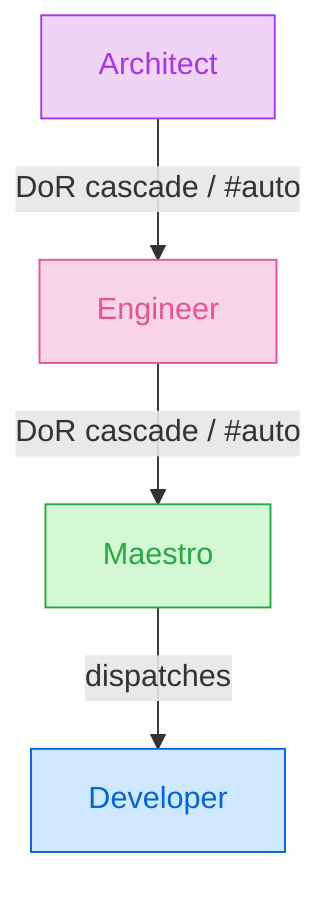

# Agents Architecture

This document is the canonical reference for the autoducks agent architecture: the command surface, the generic run flow, the four pipeline agents (Architect, Engineer, Maestro, Developer), the utility agents, branching, labels, provider abstractions, and directory layout.

---

## Command surface

```shell
/$trigger [model:$model] [effort:$effort] [turns:$turns] [#auto:$chain]
```

- **`/`** — the slash-command namespace, configurable via `command` in `.autoducks/autoducks.json` (default `/quack`). Changing it requires re-baking the workflow guards with `scripts/update-triggers.sh`.
- **`$trigger`** — a canonical verb (`architect`, `engineer`, `execute`, `fix`, `revert`, `close`), a built-in alias (`design`→architect, `tactics`→engineer, `run`/`work`→execute), or a per-team custom alias from `triggers.<agent>[]` in the config.
- **`model:`** — model override (`opus`, `sonnet`, `haiku`, or a full `claude-*` id). Bare aliases (`opus`) also work positionally.
- **`effort:`** — LLM effort override (`off`, `low`, `medium`, `high`, `max`). Bare aliases also work positionally. ("effort" follows the cross-provider convention — OpenAI `reasoning_effort`, Anthropic `output_config.effort`.)
- **`turns:`** — `max_turns` override (1–1000). `turns=N`, `max-turns=N`, and `max_turns=N` are also accepted.
- **`#auto:`** — agent chaining: `+`-separated verbs queued to run after this agent finishes, e.g. `/architect #auto:engineer+execute`. Verbs are deduplicated and capped at 5; a verb can appear at most once in a chain (loop protection).
- **`/agent <name>`** — a positional, not a `model:`/`effort:`-style, capture: the token immediately after `agent` is always read as a custom agent name (`^[a-z0-9][a-z0-9-]{0,63}$`) and never parsed as one of the aliases above, so `/agent sonnet` looks for a custom agent definition literally named `sonnet`, not the `sonnet` model alias. `/agent` alone (no name), or a name that resolves to nothing, posts the catalog of discovered custom agents instead of invoking one — see [Agent Lane](#agent-lane).

All parsing lives in [`core/config/parse-directive.sh`](../core/config/parse-directive.sh); every downstream consumer sees canonical verbs.

---

## Authorization Gate (mandatory precondition)

**Every trigger-based workflow — every agent listed below, and every future agent added to the pipeline — MUST call the Authorization Gate as its first step, before any LLM invocation, comment, reaction, branch, or PR.**

The gate is the single choke point between an untrusted GitHub event (a `/$trigger …` comment on a public repo, a workflow dispatch) and a trusted action that spends the maintainer's LLM budget and mutates the repository.

- **Interface:** [`.autoducks/core/security/authorize.sh`](../core/security/authorize.sh) — run as the first workflow step. Non-zero exit (77) stops the workflow immediately.
- **Inputs:** the actor's login and `authorAssociation`, the agent key (`architect`, `engineer`, `execute`, `fix`, `revert`, `close`, …), and the `security` block from `.autoducks/autoducks.json`.
- **Policy:** deny list (beats everything, including OWNER) → allow list → trusted `authorAssociation` allowlist (default `OWNER`, `MEMBER`, `COLLABORATOR` — `CONTRIBUTOR` is deliberately excluded) → optional CODEOWNERS extension → default deny. Per-agent overrides via `security.per_agent`. Full schema is documented in the [Security reference](../../docs/src/content/docs/reference/security.mdx).
- The gate runs **before any feedback**: a denied actor never receives a "Running…" status comment, only the denial message.

**Rule for future agents:** any new agent, command verb, or trigger surface (labels, assignments, dispatch events) MUST include the Authorization Gate call as step 0 of its behavior, prior to reacting with 👀 or any other observable side effect.

---

## Generic run flow

Every slash-command run follows the same skeleton (security first, feedback always):

0. **Pin the machinery** — immediately after checkout and before anything else, [`core/robustness/snapshot-machinery.sh`](../core/robustness/snapshot-machinery.sh) materialises the whole `.autoducks` tree from the pipeline's cut commit (`git merge-base HEAD origin/<base>`) into `$RUNNER_TEMP` and exports `AUTODUCKS_PINNED_ROOT`. Every path-invoked machinery step below — and the LLM provider's prompt/settings reads — then runs from that pinned snapshot, so an agent editing `.autoducks` on its own branch can never corrupt the scripts that run its build, and the machinery cannot drift across waves/reviews (bug #952). Git operations still target the live working tree; only the machinery is pinned. A pure-YAML **failure watchdog** at the end of the job posts a last-resort notice if the LLM step fails or `post.sh` doesn't report cleanly, so a corrupted hook can never silently freeze a wave. Caveat: `uses: ./…` composite actions (the provider action file itself, the `.github/actions` hooks) cannot be redirected — GitHub resolves them from the workspace and freezes them at job start, so they carry no intra-run corruption risk but are not commit-pinned across waves.
1. **Security gate** — `authorize.sh`, before any observable side effect.
2. **React** to the triggering comment with 👀 (`+1` on success, `confused` on failure — reactions always live on the *user's* comment).
3. **Post a bot-owned status comment** — ` **\`Agent\`**: running on [workflow #id](link)` — and **edit that same comment in place** as the run progresses (✅ finished / ⚠️ failed / 🔁 delegated). The user's comment is never edited, which keeps the revert agent's "delete bot comments, preserve human content" model intact. Module: [`core/feedback/status-comment.sh`](../core/feedback/status-comment.sh); requires `its::update_comment`. The Maestro extends this pattern across its event-driven re-runs: it maintains a single, marker-anchored **orchestration status comment** that it keeps editing in place as waves advance, rather than posting a fresh comment per re-run (see [Maestro (orchestration layer)](#maestro-orchestration-layer)).
4. **Definition-of-Ready guards** — distinct from the security gate. When an agent is not ready, it **auto-dispatches its prerequisite agent** and re-queues itself (plus any pending `#auto:` chain) behind it via [`core/orchestration/dispatch-chain.sh`](../core/orchestration/dispatch-chain.sh). Chains are depth-capped and loop-protected.
5. **Apply the layer's in-progress label** to the issue.
6. **Run the agent's specific workflow** (LLM step for Architect/Engineer/Developer/Fix; pure orchestration for Maestro/Revert/Close).
7. **Build layer only:** the Developer wraps its agentic workflow in a capped verification loop against the [`checks`](../../docs/src/content/docs/reference/configuration.mdx#checks) config — re-dispatching itself on a check failure (up to `checks.max_iterations`) before ever opening a PR. See [`core/robustness/verify-loop.sh`](../core/robustness/verify-loop.sh) and the [Developer → Verification loop](../../docs/src/content/docs/agents/developer.mdx#verification-loop) doc.
8. **Edit the status comment** to ✅ with the friendly outcome details and the `_Ran with \`model\` at effort \`level\`._` footer.
9. **Apply the layer's done label** and **assign the command author** to the issue — the assignee always marks who owns the next action (D15).

Failures never end as a silent red X: [`core/feedback/notify-failure.sh`](../core/feedback/notify-failure.sh) posts a categorized diagnosis (merge-conflict / no-changes / scope-missing / parse / max_turns / check_failed / infra) with a run-log link and a retry hint, mirrored to the parent feature when a task fails.

### Re-run semantics

There is no separate resume path: **re-issuing the same trigger comment is always the intended way to resume, refine, or correct a run**, because every agent recomputes its behavior from currently-visible ITS/git state rather than any workflow-local cache. Concretely: the Architect revises the existing design zone instead of rewriting it from scratch, and *strips* any tactical zone below it (with a warning comment, closing the orphaned task issues) — the design just changed, so the old plan is stale by construction and re-planning belongs to the Engineer; the Engineer's `Tactics:done` re-run is revision mode (existing tasks preserved by number, dropped tasks closed as superseded); the Maestro is fully idempotent (reuses the pipeline branch/PR, never re-dispatches a task with an open or merged PR); and the utility agents (Fix/Revert/Close) are idempotent teardown/repair operations. See the [Re-running agents](../../docs/src/content/docs/guides/re-running-agents.mdx) guide for the full per-stage contract.

---

## Pipeline agents



| | **Architect** | **Engineer** | **Maestro** | **Developer** |
|---|---|---|---|---|
| **Purpose** | (Design) Creates **or revises** the design of features and bugs | (Tactics) Creates the execution plan: tasks + dependency waves | (Orchestration) Coordinates parallel execution waves | (Build) Implements one task |
| **Trigger phrases** | `architect`, `design` | `engineer`, `tactics` — or `execute`/`run`/`work` on an unplanned issue | `execute`, `run`, `work` on an issue with `Tactics:done` | `execute`, `run`, `work` on a Task issue |
| **Definition of Ready** | none (any issue) | issue has `Design:done` | issue has `Tactics:done` | Task with a parent whose pipeline branch exists |
| **Auto-dispatch when not ready** | — | Architect (`architect #auto:engineer[+…]`) | Engineer (`engineer #auto:execute`) | Maestro on the parent issue |
| **Stage labels** | `Design:draft` → `Design:done` | `Tactics:crafting` → `Tactics:done` | `Work:orchestrating` → `Work:done` | `Work:coding` → `Work:done` |
| **Definition of Done** | structured design in the body; type/label `Feature` or `Bug` | plan + subtasks created/linked | all subtasks closed, final PR ready | task PR merged into the pipeline branch; task closed |

The same `execute` comment is claimed by exactly **one** workflow via label/type routing (the user never has to know which): Task issue → Developer; `Tactics:done` → Maestro; anything else → Engineer (whose DoR guard cascades to the Architect when the design is missing). A raw `/execute` on a fresh issue therefore runs the whole pipeline: Architect → Engineer → Maestro → Developers.

### Architect (design layer)

1. Preserve the tactical zone byte-for-byte if the body already has one (abort loudly on malformed markers).
2. **[AGENT]** Create the specification — or **revise/structure an existing design** — with sections: Problem Statement / Proposed Solution / Technical Design / Dependencies / Constraints / Out of Scope. Classify the issue as `Feature` or `Bug` — the Architect is the **sole authoritative source** of this classification; any pre-existing `Feature`/`Bug` label (from `/triage` or a human) is a provisional input, confirmed or overridden here.
3. Publish the new design zone (+ preserved tactical zone) to the issue body.
4. Set the native issue type and label to `Feature` or `Bug` (label is route-critical; type is best-effort, org-only). Remove `Draft` if present.
5. `Design:draft` → `Design:done`; assign the command author; continue the `#auto:` chain.

There is **no** auto-trigger by the `Draft` label (D13) — entry is by command or cascade only.

### Engineer (tactics layer)

1. **DoR:** requires `Design:done`, else delegates to the Architect with itself re-queued.
2. **[AGENT]** Produce the tactical plan **inside the tactical zone** (`<!-- autoducks:tactical:begin/end -->`); the design zone above is never rewritten. Plan = YAML `waves:` block + `## Tasks` blocks + `## Progress` checklist. **Questions Mode**: when the design is insufficient, post up to 5 blocking questions and stop instead of guessing.
3. Parse deterministically ([`core/robustness/parse-plan.py`](../core/robustness/parse-plan.py)); reconcile child Task issues (create/update/close dropped ones), link as native sub-issues with graceful degradation, replace `Tn` placeholders with real numbers.
4. **Single-task plans** create no child issue and no special label — the task lives in the tactical zone and the Maestro detects the case structurally (no waves block).
5. `Tactics:crafting` → `Tactics:done` (one label: completion record **and** routing signal). Re-running the Engineer on a `Tactics:done` issue is **revision mode** (existing tasks preserved by number, dropped ones closed as superseded).
6. Assign the command author; continue the chain (an `execute`-routed run implicitly chains to `execute`).

The Engineer is **pure ITS** — it never touches git (D7).

### Maestro (orchestration layer)

1. **DoR:** requires `Tactics:done`, else delegates to the Engineer with `#auto:execute`.
2. **Owns all pipeline git** (D7): ensures the pipeline branch — `feature/<slug>` for Features, `fix/<slug>` for Bugs (D10) — cut from `base_branch`, and the **draft PR** into `integration_branch`.
3. Computes wave states from merged task PRs (`fixes #N` bodies) **and from sub-tasks closed via a no-code-diff completion** (D17), ticks the `## Progress` checkboxes, and dispatches the next eligible wave of Developers (`autoducks-developer.yml` via `workflow_dispatch`), propagating model/effort/turns overrides and the original actor. Three independent guards prevent duplicate dispatch (open-PR check, Developer pre-flight skip, per-task concurrency group).
4. **Advancement is event-driven**: every PR merged into a `feature/*` or `fix/*` branch re-triggers the Maestro, which recomputes and continues. No polling — except a no-code-diff sub-task, which creates no PR and so explicitly re-dispatches the Maestro instead (D17).
5. **Persistent orchestration comment**: instead of stacking a new comment on every re-run, the Maestro maintains a single, marker-anchored **orchestration status comment** that it edits in place to reflect current wave state — dispatched, skipped, and blocked tasks are rendered as clickable `#N` references, so the comment always shows the latest picture rather than a scrolling history.
6. When every wave is done: rebuilds the final PR body (`Closes #…` + a `## Work Log` harvested from each task PR's Implementation Summary), marks the PR ready, requests review from the issue assignees, `Work:orchestrating` → `Work:done`, assigns the command author, and updates the orchestration comment in place with the completion summary.
7. Single-task fast path: dispatches the Developer on the feature issue itself.

### Developer (build layer)

1. **DoR (D1):** a Task must have its pipeline context. When invoked by comment without one, it resolves the parent issue; if the parent branch is missing it delegates to the Maestro on the parent. Parentless standalone execution was retired — the pipeline guarantees a reviewed design and plan before code.
2. Cuts a task branch from the pipeline branch, inheriting its prefix: `<feature|fix>/<parentNum>-issue-<taskNum>-<epoch>`.
3. **[AGENT]** Implements the task spec (may read with `git`/`gh`, never mutates); writes `/tmp/work-summary.md`.
4. Opens the task PR into the pipeline branch (`fixes #N` + Implementation Summary) and **auto-merges** it (adaptive method: `auto` probes merge/squash/rebase; 3 attempts with rebase in between; conflicts → `notify_conflict`).
5. Closes the task explicitly (sub-PR merges don't fire GitHub's auto-close) — **only for real sub-tasks**, where `ISSUE_NUM != FEATURE_NUM` (D16) — then `Work:coding` → `Work:done`, assigns the command author.
6. On `max_turns` exhaustion: commits `WIP:`, pushes the branch, and reports it — `/fix` resumes from the preserved branch.

> **Auto-merge policy:** task PRs merge into a pipeline branch that itself undergoes human review before reaching `integration_branch`. Manually-dispatched tasks against the default branch are **not** auto-merged.

> **Referencing issues in commits.** Closing keywords (`Fixes/Closes/Resolves #N`) are reserved for the delivery PR body the Maestro generates — they close the issue when the PR merges. For any other commit that merely *mentions* an issue (hotfixes, side-quests, work-in-progress), use a **non-closing** reference: `refs #N` or `re #N`. This prevents a stray commit from closing an in-flight feature/task issue on the default branch.

> **Feature-issue closure is exclusive to the delivery PR (D16).** Agents never `its::close_issue` a feature issue (`ISSUE_NUM == FEATURE_NUM`); features close **only** via the human-merged delivery PR's `Closes #N`. Real sub-tasks (`ISSUE_NUM != FEATURE_NUM`) still close on sub-PR merge — unchanged.

> **A task may legitimately complete with no code diff (D17).** The diff is ground truth: a non-empty diff always produces a PR, and no marker can suppress or fabricate one. When a task's diff is empty, an execution-time no-code result artifact (not a label/type) — written by the agent in lieu of a code change — turns that empty diff into a recorded, PR-less completion: the result is posted as a comment and the sub-task is closed without opening a PR. Because this path creates no PR and fires no merge event, the Maestro counts such a closed task as done alongside merged-PR done-ness, and is explicitly re-triggered — rather than relying on the `pull_request: closed` event — to advance the wave (see [Maestro](#maestro-orchestration-layer)).

---

## Utility Agents

Utility agents handle recovery, cleanup, and lifecycle operations. They are not part of the planning-to-execution pipeline; most have no stage labels — the Agent lane below is the exception, carrying `Agent:running` → `Agent:done`.

### Fix Agent

**Verb:** `fix` — re-runs/repairs a failed task: finds the newest existing task branch (either prefix), reads the failure context (last 10 comments), fixes on top of the partial work, reuses or opens the PR, single-attempt merge when under a parent. This is **not** the Bug flow — Bugs go through the full pipeline (D10).

### Revert Agent

**Verb:** `revert` — undoes a feature: closes child tasks as not-planned, strips pipeline labels (current and legacy), restores the last **human-authored** body revision via the edit history, and deletes only bot comments. Security default: `OWNER`, `MEMBER`.

### Close Agent

**Verb:** `close` — tears a finished pipeline down: closes child tasks and PRs, deletes task and pipeline branches (both prefixes), strips labels, closes the issue with a cleanup summary. Security default: `OWNER`, `MEMBER`.

### Update Agent

**Verb:** `update` — keeps the installed machinery current. Checks `update.source_repo` (default `deepducks/autoducks`) for a newer version on the configured `channel` (`stable`/`edge`), runs every migration under [`migrations/<version>/migrate.sh`](../migrations/README.md) for versions in `(installed, target]`, and delivers the result per `update.mode`: a pull request (`pr`, the default), a direct commit (`commit`), or no-op (`off`). Fires on `update.schedule` (baked into the workflow, like `product.schedule`), plus `workflow_dispatch` and `/update` unconditionally. Detects **drift** — local edits to vendored machinery outside the consumer-owned set ([`core/config/consumer-owned.sh`](../core/config/consumer-owned.sh)) — and either warns and proceeds or aborts, per `update.on_drift`. PR-only by default (`mode: pr`); like Revert/Close, it is not part of the planning-to-execution pipeline and carries no stage labels. Security default: `OWNER`, `MEMBER`.

### Agent Lane

**Verb:** `agent` — runs a user-authored custom agent definition inline against an issue or PR. `/agent <name>` resolves a custom agent literally named `<name>` (see the positional-name rule in [Command surface](#command-surface)); a bare `/agent`, or a name that doesn't resolve to a known definition, posts a **catalog** comment — a `name` / `description` / `source` table of every discovered, non-shadowed agent plus any discovery errors — without ever invoking the LLM. Custom agents can be disabled repo-wide via `custom_agents.enabled: false`, checked before any definition is opened.

Discovery ([`core/config/discover-agents.sh`](../core/config/discover-agents.sh)) scans four roots, **highest precedence first** — the first match for a given name wins; later roots still appear in the catalog with `shadowed: true`:

1. `.autoducks/custom/agents/<name>/agent.md`
2. `.claude/agents/<name>.md`
3. `.agents/<name>.md`
4. `.github/agents/<name>.md`

Any roots listed in `custom_agents.roots[]` (config) are appended after root 4, in order, scanned the same way as roots 2–4 (flat `<name>.md`). A definition's frontmatter (`name`, `description`, `model`, `effort`, `max_turns`, `surface`, `tools`, `context`, `labels`) is read by a small, `eval`-free scalar/array parser — never a YAML interpreter that could execute tags. `custom_agents.agents.<name>` in `.autoducks/autoducks.json` can override a definition: `tools` from config wins over frontmatter outright (no union/intersection), except that `required_tools` from `.autoducks/agents/agent/defaults.json` is always unioned in — it is the floor the lane's own output contract needs (`Write`, for `/tmp/agent-response.md`), so a definition cannot replace away the ability to answer at all; `model`/`effort`/`max_turns`/`context` from frontmatter win over config.

**Definitions come from the base branch, always.** Discovery reads each definition — and the `custom_agents` config keys that grant tools — from `AUTODUCKS_BASE_REF`, never from the checked-out tree. A definition body becomes the agent's prompt and its frontmatter asks for tools, so it is executable content; on a pull request the checkout is `refs/pull/N/head`, and running from there would mean executing code nobody has reviewed. Reading from the base branch is what makes the "merged, reviewed repo content" premise above true *by construction*, and is why this lane needs no per-definition verification and no per-definition clamp. What it is **not** is a blanket tool ceiling: a definition that declares no `tools` falls through to `.defaults.tools`, which the workflow loads from the pinned machinery snapshot rather than from this ref, and [`resolve-prompt.sh`](../core/config/resolve-prompt.sh)'s `.autoducks/custom/` prompt overlays are live-tree reads, as in every lane. Both sources are reviewed content in the ordinary case; neither is guaranteed by the base-ref read described here. The consequence, stated plainly: an agent cannot be tried from the pull request that introduces it — merge the definition first, then use it. A `/agent` run on a pull request still works and still sees that pull request as its context; only the definition comes from elsewhere.

**Concurrency, and one behaviour worth knowing.** The lane's concurrency group is the issue-or-PR number alone, with `cancel-in-progress: false`, so invocations on one issue serialize — including different custom agents. The agent name cannot be part of the key: on a comment trigger the expression engine cannot split it out of the body, and keying on the body itself let two `/agent foo` invocations that differed only in steering text race two pushes to the same `agent/<name>/…` branch. The consequence to know about: GitHub keeps at most one *pending* run per group, so if one run is executing and one is already queued, a third `/agent …` on the same issue is cancelled before its first step. There is no 👀, no status comment and no failure notice — the command simply does not happen, and has to be re-issued. A name must match `^[a-z0-9][a-z0-9-]{0,63}$` and can never shadow a built-in verb, synonym, or configured `triggers.<agent>[]` alias — a collision is a discovery error (`reserved-name`), not a silent skip, same treatment as an invalid name (`invalid-name`), an empty body (`empty-body`), a definition that cannot be read at the ref (`unreadable`), a symlinked definition (`symlink-escape`), or a definition over 64KB (`too-large`). Symlinks are refused by tree mode, so the refusal covers any symlink, not only one whose target escapes the repo: reading from a ref leaves no realpath to compare against the repo root.

The LLM step itself is restricted to read-only `git`/`gh` exploration (`git log/show/diff/status/blame/rev-parse/branch --list`, `gh issue view/list`, `gh pr view/diff/list`, `gh issue comment`) plus a writable filesystem, and has exactly one output contract: write `/tmp/agent-response.md`. All mutation happens afterward, in `post.sh`: when the working tree is unchanged, the response is posted as an issue comment and nothing else happens; when the agent changed files, `post.sh` commits them onto a fresh `agent/<name>/<issue>-<slug>` branch (see [Branch Naming](#branch-naming)) and opens a PR. That PR is **not a pipeline deliverable** — it references the triggering issue (`Ref #N`, never a closing keyword) and is left open for human review rather than auto-merged. `Agent:running` → `Agent:done` (see [Labels](#labels)) brackets the run like the pipeline agents, even though the lane sits outside the planning-to-execution pipeline.

---

## Reviewer Agent

**Verb:** `review` — judges an already-implemented pull request against its design and task acceptance criteria. Read-vs-mutation: never edits code, may run read-only `git`/`gh` commands for exploration but never `git`/`gh` mutations, never merges. No Definition-of-Ready cascade, invoked on demand; unlike the utility agents above it does carry its own stage labels (`Review:reviewing` → `Review:done`/`Review:changes`).

1. Resolves the target PR (direct PR comment, or the open pipeline PR for the feature/bug issue) and gathers context: the design, task acceptance criteria, the unified diff, PR metadata, and — staged by `pre.sh` at `/tmp/security-guidelines.md` — the repository's optional security guidelines (`review.security_guidelines` in `.autoducks/autoducks.json`, default `.autoducks/security-guidelines.md`; the file left empty when absent).
2. **[AGENT]** Explores the repo read-only and writes `/tmp/review.md`. **Security is a dedicated review dimension**, not a separate output: alongside correctness/consistency findings, the LLM checks the diff against `/tmp/security-guidelines.md` when non-empty, applying those rules with priority, and falls back to a built-in baseline checklist otherwise (AuthZ/AuthN, injection, secrets, SSRF/path traversal, deserialization/eval, crypto misuse, unsafe defaults, dependencies). Security findings land in the same **Findings** section as any other, tagged `security`.
3. **Verdict mapping is unchanged** by the security dimension: `request-changes` iff at least one `blocker`/`major` finding (a security finding included) or any acceptance criterion `missing`; `approve` iff no finding above `nit` and every criterion `met`; `comment` otherwise. `approve` is never published as a formal GitHub `APPROVE` event.
4. Submits the review via `git::submit_pr_review`; `Review:reviewing` → `Review:done` (approve/comment) or `Review:changes` (request-changes).

---

## Provider Abstraction

autoducks is designed to be platform-agnostic. All external interactions go through three provider interfaces:

| Provider | Prefix | Responsibility | Default implementation |
|----------|--------|----------------|----------------------|
| **ITS** (Issue Tracking System) | `its::` | Issues, PRs, labels, comments, assignments | GitHub (via `gh` CLI) |
| **Git** | `git::` | Branches, commits, merges, repository operations | Git CLI |
| **LLM** | `llm::` | Agent reasoning, plan generation, code writing | Claude Code |

Each provider exposes a set of functions behind a stable interface (`providers/{its,git}/interface.sh` validates the contract at source time). Swapping providers requires implementing the same function signatures without changing agent logic. The full required-function lists live in the interface files; notable additions for the status-comment flow: `its::update_comment(comment_id, body)` and `its::assign_issue(issue_id, assignee)`.

---

## Branch Naming

All branches follow a predictable convention rooted in issue IDs. The prefix encodes the issue kind (D10).

| Context | Pattern | Example |
|---------|---------|---------|
| Feature pipeline branch | `feature/<number>-<slug>` | `feature/42-user-auth` |
| Bug pipeline branch | `fix/<number>-<slug>` | `fix/57-login-crash` |
| Task under a pipeline branch | `<feature\|fix>/<parent>-issue-<task>-<epoch>` | `feature/42-issue-43-1751941200` |
| Fix-utility retry branch | `<feature\|fix>/<parent>-issue-<task>-fix-<epoch>` | `feature/42-issue-43-fix-1751943000` |
| Agent lane branch | `agent/<name>/<issue>-<slug>` | `agent/sonnet/42-user-auth` |

The Maestro's PR-merged re-trigger listens on both `feature/*` and `fix/*`. The fix-utility `-fix-<epoch>` suffix is unrelated to the `fix/` prefix. The Agent lane's `agent/<name>/…` branches are outside the pipeline (see [Agent Lane](#agent-lane)) and are never watched by the Maestro.

### Where the base branch comes from

Two sources, in this order, and **never a literal** (#1181):

1. **`defaults.base_branch`** in `autoducks.json` — the explicit operator override. Set it when the pipeline should run off a branch that is not the repository's default.
2. **The repository's own default branch** — `github.event.repository.default_branch` in a workflow expression, `gh api repos/$REPO --jq .default_branch` in a script.

`main` was previously hardcoded as the fallback in `autoducks-commit-lint.yml` and `autoducks-developer.yml`, so a repo on `master` got a push trigger that never fired and a checkout of a ref that did not exist — both silently, because a trigger that does not fire is indistinguishable from one with nothing to report.

**The Update lane installs onto the default branch, not `base_branch`.** Every lane runs `actions/checkout@v4` with no `ref:` on a scheduled or dispatched trigger, so the workflow files and `.autoducks/` scripts that execute are the default branch's copy. That makes the default branch the only place an install takes effect, which is a fact about the host rather than a preference. `base_branch` answers a different question — where the pipeline cuts `feature/`/`fix/` branches from — and the two are the same branch in most repos. Where they differ, delivering to `base_branch` produced an update that reported success and changed nothing: `deepducks/swanapse` cuts from `master` but is served from `ggondim`, and took two consecutive releases on `master` while every run kept executing the older machinery on `ggondim`. `update/run.sh` resolves `UPDATE_TARGET_BRANCH` from [`git::default_branch`](../providers/git/interface.sh), falling back to `base_branch` with a warning only when the host cannot answer.

**`AUTODUCKS_BASE_BRANCH` carries source 1 only, and may be empty.** `load-config.sh` exports the configured value verbatim and does not resolve step 2; the caller does, because the caller knows whether it can reach the host. [`sync-child-gitlinks.sh`](../core/orchestration/sync-child-gitlinks.sh) is the reference shape: config, then the host API, then a warning and a clean exit rather than acting on a branch named `""`.

Resolving step 2 inside `load-config.sh` is a tempting simplification and a mistake. The only source available there without a token is `origin/HEAD`, a local ref that can be stale or absent, and populating the variable from it silently preempts the authoritative answer the caller was about to fetch.

Two consequences worth knowing:

- **The push trigger cannot express this.** `on.push.branches` takes glob patterns only, never an expression. `autoducks-commit-lint.yml` therefore subscribes broadly, excludes pipeline branch prefixes, and makes the default-branch decision in the job's `if:`, where the value is reachable. Same shape as `autoducks-delivery-check.yml`, and for the same reason: exclusion filters survive a rename, allow-lists do not.
- **The Agent lane reads source 2, not source 1.** `AUTODUCKS_BASE_REF` is built from the repository default branch, deliberately: the lane's security premise is "merged, reviewed repo content" (see [Agent Lane](#agent-lane)), and the repository default is the better answer to that than a config key any contributor could edit. On a repo where the two disagree, custom agent definitions come from the repository default while every other lane follows the configured value. `setup.sh` check 16 reports the divergence rather than resolving it, since a deliberate split is legitimate.

---

## Metarepo mode (submodule aggregation)

Gated on `metarepo.enabled` (config) → `AUTODUCKS_METAREPO` (env). When off (the default), everything below is inert and single-repo behaviour is byte-identical. When on, autoducks drives a private **metarepo** whose child repos are git submodules, without waking the children's own pipelines.

**Config** (`autoducks.json`):
```json
"metarepo": {
  "enabled": true,
  "protected_submodule_strategy": "auto_merge",   // or "required_check"
  "delivery_check": {                              // only used by required_check
    "check_name": "Autoducks: Children delivered",
    "timeout_minutes": 45,
    "poll_interval_seconds": 30
  },
  "auth": { "mode": "single_pat" },                // single_pat | per_owner_pat | github_app
  "submodules": {}
}
```
Enabling metarepo mode **forces `orchestrator.mode = sequential`** (load-config). The child repo/url/path are read from `.gitmodules` — never duplicated in config.

**Branch & execution model.** Child branches **mirror the parent pipeline branch** `feature/<N>-<slug>`, created lazily off the pinned SHA. Real code is committed **directly onto the child feature branch**; the parent task branch carries only **gitlink bumps**. Execution is **backpressured (max-in-flight = 1)**: each task branches off the *merged* result of the previous one, so the gitlink only ever moves forward (no write-race) and every task builds against the current state of its dependencies. The Engineer declares, per task, a `**Modules:**` list (submodule paths) and orders inter-module dependencies as **wave edges** (a task needing another module's change goes in a later wave).

**`modules:` field.** `parse-plan.py` parses the optional `**Modules:**` section, validates each entry against `.gitmodules`, and embeds a structured marker `<!-- autoducks:modules: a,b -->` in the task issue body. The developer reads it for the **drift guard** (changed submodules ⊆ declared modules — an undeclared edit fails the task); Maestro reads it to compute the affected-children union at delivery.

**Push order (HANDOFF).** `git::commit_push_recursive` pushes every changed child **first** (`HEAD:refs/heads/<feature>`), then commits the parent gitlinks — so a fresh clone always resolves. The parent branch push follows.

**Delivery (children-first, parent last).** At feature completion Maestro runs `git::submodule_deliver` per affected child **before** the parent final PR; the human merges the parent last. Until #119 the parent gitlink pinned the child *feature-branch* SHA (`Y`) on the theory that keeping `Y` reachable from the child's default branch was enough. **It is not**: a gitlink is an opaque SHA that GitHub merges 3-way, so a parent PR pinning `Y` conflicts as soon as the base's gitlink moves, reachable or not. The contract is now **the pin is the tip of the child's default branch**, reconciled at delivery when the merge is synchronous and late (see *Gitlink reconciliation* below) when it is not. `git::submodule_deliver` honors `AUTODUCKS_MERGE_METHOD` (`merge`|`squash`|`rebase`|`auto`; `auto` prefers a merge commit for children) and returns the SHA the parent should pin, plus `needs_repin=1` when that differs from `Y`:

- **Unprotected + `merge`** → fast-forward the default branch to `Y` (main becomes `Y`) and delete the feature branch. If the default branch has diverged (FF impossible), fall back to a **merge commit** via the merges API rather than force-pushing — and pin *that merge commit*, since it, not `Y`, is now the tip.
- **Protected default branch** → open a marked child PR and enable GitHub **auto-merge with a merge commit** (`gh pr merge --merge --auto`). A protected branch usually gates on required checks that only pass *after* the PR opens, so GitHub merges when they go green. That merge is **asynchronous**, so its resulting SHA is unknowable here: the pin returned is provisional and the delivery poller reconciles it once the child PR reports `MERGED`. Protected delivery always uses a merge commit and ignores a squash/rebase `merge_method` (a squash would rewrite the SHA under an async merge, leaving nothing to re-pin synchronously). Falls back to an immediate merge commit when the repo disallows auto-merge and no checks are pending — that merge *is* synchronous, so its tip is pinned directly.
- **Unprotected + `squash`/`rebase` policy** → open a marked child PR and merge it with the configured method. Squash/rebase **rewrites the SHA** to a new commit `S` on the default branch (no required checks to wait on, so this is synchronous): `Y` is abandoned, so Maestro **re-pins** the parent gitlink to `S` (via `metarepo::repin_gitlinks`, a `git update-index --cacheinfo` bump committed onto the feature branch) and only then deletes the retained child branch. This is how the autoducks squash policy is supported without orphaning the pin (HANDOFF gotcha #7).

**Delivery-check strategy (`protected_submodule_strategy: required_check`).** An alternative to `auto_merge` for protected children, implemented entirely as **parent-side polling — there is no child→parent bridge**. The parent's final PR is gated on a required check, `Autoducks: Children delivered` (from `metarepo.delivery_check.check_name`), driven by the `Autoducks: Delivery Check` workflow (`.github/workflows/autoducks-delivery-check.yml`) on every `opened`/`synchronize`/`reopened`/`ready_for_review` event. It runs `poll-child-deliveries.sh`, which: derives the affected children from the `<!-- autoducks:modules: ... -->` marker on the final PR body, filters to protected children (unprotected ones were already delivered synchronously by `submodule_deliver`, same as under `auto_merge`), resolves each one's delivery PR, and polls `gh pr view --json state,mergedAt,statusCheckRollup` until every protected child has merged (check → `success`), one is closed unmerged or carries a failing/errored/timed-out check (check → `failure`), or `metarepo.delivery_check.timeout_minutes` elapses (check → `failure`). The poller never merges a child and never comments, and keeps no workflow-local state, so its conclusion is a pure function of current remote state — a re-run simply re-derives it. It does have two bounded side effects that nothing else in the pipeline was positioned to perform (#119): a **draft→ready toggle** on a child delivery PR with an *empty* `statusCheckRollup` (a required check that was never produced, so `--auto` can never fire — after one more empty window the check concludes `failure` with that diagnosis instead of hanging to the timeout), and a **gitlink-only commit** on the parent PR's own head branch.

**Gitlink reconciliation (`metarepo::reconcile_gitlinks`).** Fast-forwards an open parent PR's gitlinks to each child's current default-branch tip. It covers the two staleness sources delivery cannot: an async auto-merge that could not report its resulting SHA, and a **sibling parent PR merging**, which moves the base's gitlink out from under every other open parent PR (this is what flipped `meta#108` to `CONFLICTING` four minutes after `meta#97` merged). It runs from the delivery poller for one PR, and from two jobs of the same workflow covering every way a gitlink moves: `repin-siblings` (on `pull_request: closed` + `merged == true`) reconciles every *other* open parent PR after a merge, and `repin-on-base-push` (on `push` to the default branch) reconciles *all* of them after a direct commit, which fires no `pull_request` event at all. `metarepo::pin_relation` gates it via the compare API: only a **`behind`** pin (an ancestor of the tip) is moved; `ahead` means the delivery has not merged yet and is left alone, `diverged` is reported for a human. Because a reconcile commit changes the PR head, the poller mirrors its conclusion onto the new head SHA too, so the required check stays satisfied even when the push credential fires no `synchronize` event.

**`metarepo.delivery_check` config** (only consulted under `required_check`):
- `check_name` (default `"Autoducks: Children delivered"`) — the check-run name; also the status-check context `scripts/setup.sh` registers on the gate branch (ruleset `autoducks-delivery-required`), so the emitted check and the ruleset that requires it can never drift apart.
- `timeout_minutes` (default `45`) — how long the poller waits for every protected child to merge before concluding `failure`; internally capped at 5h regardless of config, to stay well under GitHub's 6h job ceiling.
- `poll_interval_seconds` (default `30`, floored at `30`) — sleep between polling rounds.
- **Actions-minutes cost.** The poller holds a runner for the whole wait — up to `timeout_minutes`, one poll every `poll_interval_seconds` — so it bills real job wall-clock, not idle time (e.g. a 45-minute timeout at the 30s floor is up to ~90 rounds). Tune `timeout_minutes` down and/or `poll_interval_seconds` up on Actions-minutes-constrained repos.
- **Manual failure recovery.** A `failure` conclusion (child PR closed unmerged, a failing/errored/timed-out child check, or a timeout) does not self-retry. Fix it via the child's own CI/PR — push a fix commit, satisfy the failing check, or reopen/re-merge — then either push any commit to the parent's final PR (its `synchronize` event re-triggers the workflow) or manually re-run the `Autoducks: Delivery Check` workflow from the Actions tab. Either path re-polls from current child-PR state; there is no stored history to reconcile.

**Child skip-marker** (general capability, ships to all installs). Child PRs opened by a metarepo carry `<!-- autoducks:metarepo-managed -->` in the body (or the `Autoducks:external` label). The child's own **reviewer / rework / commit-lint** `if:` guards honour it and skip, keeping the child pipeline dormant.

**Auth — per-owner resolution.** A fine-grained PAT is single-owner, so every cross-repo git/gh op goes through the `git::resolve_token(repo)` seam: `single_pat` (default) uses `AUTODUCKS_PAT`; `per_owner_pat` maps owner → `AUTODUCKS_PAT_<OWNER>`; `github_app` (rides on #1106's broker) mints an installation token per owner. An **access pre-flight gate** (`metarepo-access-gate.sh`) probes write access with the credential that will push — at installer-doctor time and at run start (developer/fix `pre.sh`) — and stops **before any branch is cut**, escalating to the user with the owner-specific fix.

**Protected-child merge settings.** Protected delivery always merges via a merge commit (see above), so every **protected** child repo must have `allow_merge_commit=true` and `allow_auto_merge=true`. The cloud wizard now asserts both at install time, via the Worker's admin-scoped installation token (`setup.repo_settings` in `autoducks.json`). The access pre-flight gate remains the **runtime backstop**: it reads both off the same `gh api repos/<slug>` probe and fails **before any branch is cut** if either is off on a protected child, which is what still catches repos that were set up before this assertion shipped, or whose settings changed since. An absent `setup` block means every `repo_settings` default is on, so the gate's behaviour for pre-existing installs is unchanged. Fix: `gh api -X PATCH repos/<owner>/<repo> -F allow_merge_commit=true -F allow_auto_merge=true`.

---

## Labels

| Label | Meaning |
|-------|---------|
| `Draft` | Optional human marker: issue still needs design work (removed by the Architect) |
| `Feature` / `Bug` | Routing + classification — set as a label (route-critical) and as the native issue type (best-effort, org-only). May be applied provisionally by the Product Owner (`/triage`) or a human; the Architect is the sole authoritative source and confirms or overrides it during design — no separate strip step |
| `Task` | Marks a task issue split from a plan — label + best-effort native type |
| `Design:draft` | Architect is writing the design |
| `Design:done` | Design complete (Engineer's Definition of Ready) |
| `Tactics:crafting` | Engineer is building the plan |
| `Tactics:done` | Plan complete — also the Maestro's routing signal and the Engineer's revision-mode marker |
| `Work:orchestrating` | Maestro is coordinating waves on this issue |
| `Work:coding` | Developer is implementing this task |
| `Work:done` | Work complete (task merged, or all waves finished) |
| `Agent:running` | Agent lane is running a custom agent definition |
| `Agent:done` | Custom agent run complete (response posted, PR opened if the tree changed) |

**Case-insensitivity.** Label matching across the bash/jq machinery is case-insensitive: routing compares label names without regard to case, so a label typed or created with different casing than the canonical taxonomy above is still recognized. `setup.sh` enforces this at source — when a required label collides case-insensitively with an existing GitHub default (e.g. a repo's stock `bug` colliding with the canonical `Bug`), it renames the existing label to the canonical casing via `gh label edit`, which preserves the label's issue associations rather than creating a duplicate. This auto-rename can be opted out of with `--no-rename` (or `AUTODUCKS_LABEL_AUTORENAME=0`), in which case setup reports the collision and leaves it for manual resolution. The GitHub Actions expression layer (the `if:` guards baked by `scripts/update-triggers.sh`) has its own, separate case-insensitivity guarantee — `contains()`, `startsWith()`/`endsWith()`, and `==` are documented as case-insensitive there too — but the bash layer does not inherit that guarantee from the Actions layer, or vice versa; the two are deliberately redundant, independent protections: normalization-at-source protects the Actions `if:` guards (which only ever test machinery-created label strings), and case-insensitive comparison protects everything running in bash.

Retired (cleaned up on sight by revert/close/engineer): `Spec:draft`, `Spec:plan`, `Tactics:ready`, `Ready`, `Work:progress`, `Tactics:single`, `priority:P0..P3`.

---

## Directory Structure

```
.autoducks/
  autoducks.json          # Project configuration: command prefix, providers,
                          # defaults (model/effort/branches/merge), triggers, security
  VERSION                 # Installed machinery version (semver, e.g. 0.1.0)
  CHANGELOG.md            # Keep-a-Changelog history; `### Breaking` marks a non-additive release
  assets/                 # Static assets (status-comment loading.gif)
  design/
    AGENTS.md             # This document — canonical agent architecture reference
  agents/
    architect/            # defaults.json + prompt.md + pre.sh/post.sh
    engineer/             # defaults.json + prompt.md + pre.sh/post.sh
    maestro/              # defaults.json + run.sh (no LLM)
    developer/            # defaults.json + prompt.md + pre.sh/post.sh
    fix/                  # defaults.json + prompt.md + pre.sh/post.sh
    revert/               # defaults.json + run.sh (no LLM)
    close/                # defaults.json + run.sh (no LLM)
    update/               # defaults.json + run.sh (no LLM)
    agent/                # defaults.json + prompt.md + pre.sh/post.sh (custom agent lane)
  migrations/
    <version>/migrate.sh  # Consumer-owned config migrations, run in ascending semver order
  core/
    config/               # load-config, load-agent-defaults, parse-directive,
                          # generate-trigger-conditions, discover-agents,
                          # interpolate-artifacts
    feedback/             # status-comment, progress-labels, react-to-comment,
                          # notify-failure, update-checkboxes
    orchestration/        # dispatch-chain, branch-prefix, parse-waves,
                          # reconcile-tasks, tactical-zone, create-final-pr,
                          # prevent-duplicate-dispatch, build-revision-context
    robustness/           # parse-plan.py, ask-questions, assert-changes,
                          # wait-for-branch, retry-on-parse-failure
    security/             # authorize, parse-codeowners, resolve-team
  providers/
    its/                  # ITS provider implementations (github/)
    git/                  # Git provider implementations (github/)
    llm/                  # LLM provider implementations (claude/)
  runtimes/
    github-actions/       # Canonical workflow templates (mirrored to .github/workflows/)
```
